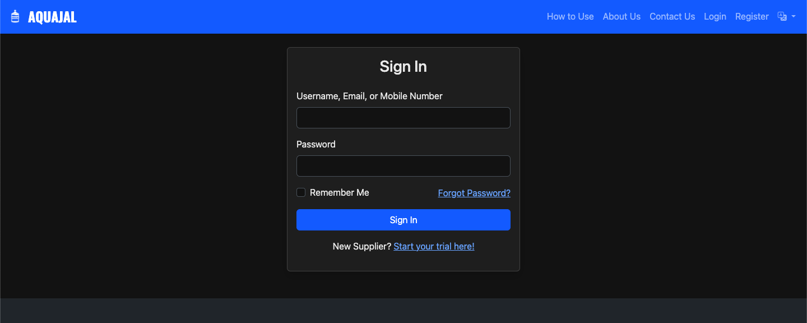

💧 Aquajal - Water Supply Management System
===========================================

**Aquajal** is a comprehensive web application tailored to manage a **water jar supply business**.

It supports a **multi-user environment** with roles for administrators, managers, delivery staff, and customers — streamlining operations like delivery logging, stock management, and customer interactions.

📚 Table of Contents
--------------------

*   [🚀 Key Features](https://chatgpt.com/#-key-features)
    
*   [🐳 Deployment on Synology NAS with Docker](https://chatgpt.com/#-deployment-on-synology-nas-with-docker)
    
    *   [📋 Prerequisites](https://chatgpt.com/#-prerequisites)
        
    *   [⚙️ Step 1: Prepare the Project](https://chatgpt.com/#-step-1-prepare-the-project)
        
    *   [📁 Step 2: Persistent Data Directory](https://chatgpt.com/#-step-2-persistent-data-directory)
        
    *   [🧱 Step 3: Build & Run the Container](https://chatgpt.com/#-step-3-build--run-the-container)
        
    *   [🌍 Step 4: Access the Application](https://chatgpt.com/#-step-4-access-the-application)
        
*   [🔑 Default Login Credentials](https://chatgpt.com/#-default-login-credentials)
    
*   [💻 Local Development Setup (Without Docker)](https://chatgpt.com/#-local-development-setup-without-docker)
    
*   [🖼️ Screenshots](https://chatgpt.com/#-screenshots)
    
*   [👨‍💻 Author](https://chatgpt.com/#-author)
    
*   [📄 License](https://chatgpt.com/#-license)
    

🚀 Key Features
---------------

### 🔐 Role-Based Access Control

*   **Admin:** Manages businesses, users, and system settings
    
*   **Manager:** Manages staff, inventory, reports, and customers
    
*   **Staff (Delivery):** Logs deliveries, expenses, and cash
    
*   **Customer:** Views delivery history, books jars for events
    

### 🏢 Multi-Business Support

*   Manage multiple locations/plants with separate staff, pricing, and inventory
    

### 📦 Customer & Delivery Management

*   Staff can log daily deliveries with auto-calculated collection amounts
    

### 🧾 Inventory Management

*   Track and update jars and dispensers in stock
    

### 💰 Expense Tracking

*   Log daily delivery-related expenses (e.g. fuel) and auto-deduct from cash
    

### ⚙️ Wage Calculation

*   Scheduled jobs calculate and deduct wages based on daily performance
    

### 🌐 Customer Portal

*   Customers can request jars, view history, and manage event bookings
    

🐳 Deployment on Synology NAS with Docker
-----------------------------------------

Deploy Aquajal on your Synology NAS using Docker in just a few steps.

### 📋 Prerequisites

*   ✅ Synology NAS with **Docker support**
    
*   ✅ Docker installed via **Package Center**
    
*   ✅ Project files: Dockerfile, docker-compose.yml, requirements.txt
    

### ⚙️ Step 1: Prepare the Project

1.  Open **File Station** on your Synology NAS
    
2.  Create: docker/aquajal/
    
3.  Upload project files into this folder
    

### 📁 Step 2: Persistent Data Directory

1.  Inside docker/aquajal, create a new folder: data
    
    *   Stores the **SQLite database** and file uploads
        
2.  The provided docker-compose.yml is already configured to use this directory
    

### 🧱 Step 3: Build & Run the Container

#### ✅ Enable SSH on your NAS

1.  Go to **Control Panel → Terminal & SNMP**
    
2.  Enable **SSH service** → Click **Apply**
    

#### 🔗 Connect to NAS via SSH

ssh your_nas_username@your_nas_ip_address

#### 🛠️ Navigate & Build

cd /volume1/docker/aquajal  sudo docker-compose up --build -d  

#### 📄 View Logs (Optional)

sudo docker-compose logs -f  

You should see Gunicorn starting. Press Ctrl + C to exit logs.

### 🌍 Step 4: Access the Application

Visit:👉 **http://your\_nas\_ip\_address:2942**

You should see the **Aquajal login page**.

🔑 Default Login Credentials
----------------------------

After deployment, seed the database to create default users.

cd /volume1/docker/aquajal  sudo docker-compose exec web flask seed-db

RoleUsernamePasswordAdminadminadminpassManagermanagermanagerpassStaffstaffstaffpass

💻 Local Development Setup (Without Docker)
-------------------------------------------

Set up Aquajal locally for development:

## Clone the repository  git clone   cd aquajal-app  # Create a virtual environment  python3 -m venv venv  source venv/bin/activate  # Install dependencies  pip install -r requirements.txt  # Initialize database  flask db upgrade  # Seed database (optional)  flask seed-db  # Run the app  flask run

App will run at:👉 [**http://127.0.0.1:5000**](http://127.0.0.1:5000/)

🖼️ Screenshots
---------------

       

👨‍💻 Author
------------

**Rajat Poddar**💼 Developer & Maintainer of Aquajal📧 _\[Contact Me\]_🌐 [GitHub Profile](https://github.com/yourusername)

📄 License
----------

This project is licensed under the **MIT License**.See the [LICENSE](https://chatgpt.com/LICENSE) file for details.

Let me know if you'd like a version with collapsible sections, badges linked to resources, or a GitHub-friendly table of contents generator.
